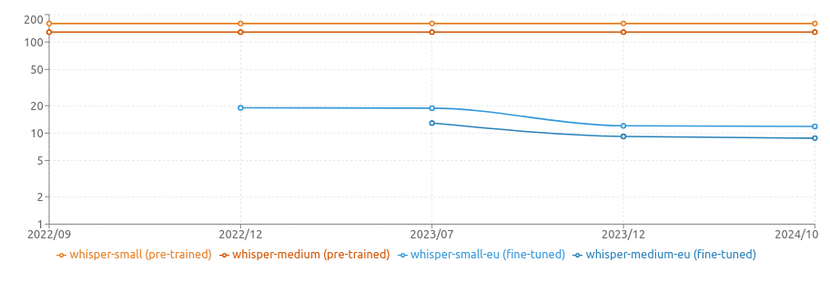

# Ebaluazioa

## Emaitzak

Ondorengo taula honetan ikus daitezke Whisper jatorrizko (*pre-trained*) ereduaren eta moldatutako euskarazko ereduaren ebaluazio emaitzak.

Zehazki, *Common Voice* datu-multzoa handituz joan den ehinean, ereduek izan duten hobekuntzak ikus daitezke.

*Oharra: normalizatutako WER/CER balioak*

### Whisper *small* eredua

#### Jatorrizko eredua (*pre-trained*)

| Data | Eredua | WER | CER |
| ---- | ------ | --- | --- |
|2022/10 | whisper-small | 159.58 | 57.71 |


#### Euskarazko ereduak (*fine-tuned*)

| Data | Eredua | WER | CER | Dataset | Bal. orduak |
| ---- | ------ | --- | --- | ------- | ------------ |
|2022/12 | whisper-small-eu | 18.95 | - | CV11.0 | 100 |
|2023/07 | whisper-small-eu | 18.77 | - | CV13.0 | 101 |
|2023/12 | whisper-small-eu | 12.01 | - | CV16.0 | 220 |
|2024/10 | whisper-small-eu | 11.84 | 2.31 | CV17.0 | 274 |
|2025/02 | whisper-small-eu | **8.33** | 1.77 | composite_corpus_eu_v2.1 | 676 |

### Whisper *medium* eredua

#### Jatorrizko eredua (*pre-trained*)

| Data | Eredua | WER | CER |
| ---- | ------ | --- | --- |
| 2022/10 | whisper-medium  | 128.34  | 57.2 |

#### Euskarazko ereduak (*fine-tuned*)

| Data | Eredua | WER | CER | Dataset | Bal. orduak |
| ---- | ------ | --- | --- | ------- | ------------ |
| 2023/07 | whisper-medium-eu | 12.88 | - | CV13.0 | 101 |
| 2023/12 | whisper-medium-eu | 9.18 | - | CV16.0 | 220 |
| 2024/10 | whisper-medium-eu | 8.80 | 1.66 | CV17.0 | 274 |
| 2025/02 | whisper-medium-eu | **7.14** | 1.44 | composite_corpus_eu_v2.1 | 676 |

### Ebaluazioa datu-multzo ezberdinetan (composite_corpus_eu_v2.1)

Euskarazko ereduek emaitza ezberdinak lortzen dituzte datu-multzo ezberdinetan. Hona hemen, _composite_corpus_eu_v2.1_ testeko azken emaitzak hiru datasetentzako:

| Eredua | Common Voice (WER) | Parliament (WER) | OSLR (WER) |
| ------ | ----------------- | ---------------- | ---------- |
| whisper-tiny-eu | 13.56 | 9.4 | 26.65 |
| whisper-base-eu | 10.78 | 8.69 | 23.9 |
| whisper-small-eu | 7.63 | 6.3 | 17.6 |
| whisper-medium-eu | 7.14 | 6.17 | 16.72 |
| whisper-large-eu | **4.84** | **4.96** | **11.96** |




## Bestelako alternatibak

[HiTZ zentroak](https://www.hitz.eus/) 2024ko apirilean honako bi STT eredu berri hauek argitaratu ditu, Nvidia NeMo teknologia erabiliz:

- [HiTZ/stt_eu_conformer_transducer_large](https://huggingface.co/HiTZ/stt_eu_conformer_transducer_large) (WER 2.79 w/ CV16.1)
- [HiTZ/stt_eu_conformer_ctc_large](https://huggingface.co/HiTZ/stt_eu_conformer_ctc_large) (*WER 2.42* w/ CV16.1)

Hauek dira momentuan euskarazko STT eredu onenak.


## Nola burutu ebaluazioa?

### *Fine-tuning* egiteko prozesuan bertan

*Fine-tuning*-a egiteko erabili den Python scriptak berak ebaluazioa burutzeko aukera ematen du. 

Horretarako, *fine-tuning* prozesuan erabiliko den *dataset* berdina erabiliko da. Hurrengo parametroak zehaztu behar dira:

```bash
--eval_split_name="test" \
--per_device_eval_batch_size=8 \
--evaluation_strategy="steps" \
--eval_steps=1000 \
--do_eval \
--do_normalize_eval \
```

### Ebaluazioa soilik

Ebaluazioa soilik burutzeko, direktorio honetako scriptak erabili daitezke.

```bash
bash run_eval.sh
```

Ebaluazioko parametroak zehaztu behar dira. Horretarako, editatu `run_eval.sh` fitxategia:

```bash
#! /usr/bin/env bash

python3 evaluate_on_hf_dataset.py \
--is_public_repo True \
--hf_model xezpeleta/whisper-medium-eu \
--language eu \
--dataset "mozilla-foundation/common_voice_17_0" \
--config eu \
--split test \
--device 0 \
--batch_size 16 \
--output_dir predictions
```

Adibide honetan, `whisper-medium-eu` eredua erabiliko da, `eu` hizkuntza eta `mozilla-foundation/common_voice_17_0` *dataset* erabiliko da.

Emaitzak `predictions` direktorioan gordeko dira.
