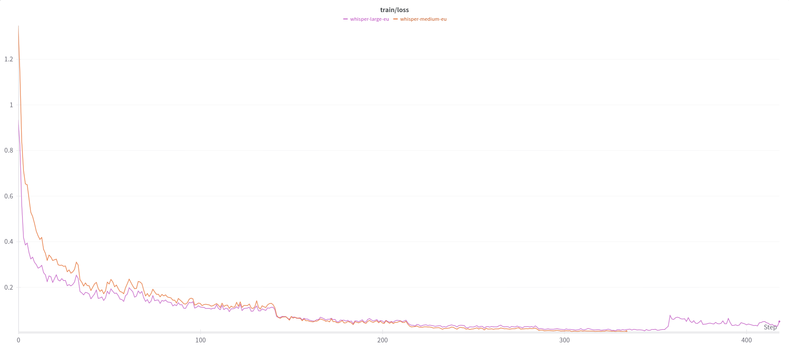
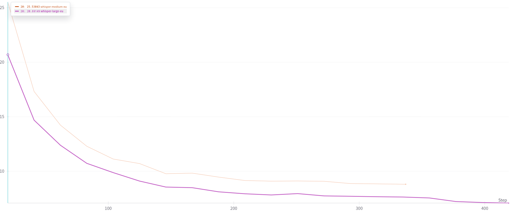

# Whisper euskarazko ereduak sortzeko prozesua

## Erabilitako erreferentziak

Ereduaren lehen *fine-tuning* prozesua 2022ko abenduan egin nuen, hurrengo iturri hauetan oinarrituz:

- [Fine-tune whisper for multilingual ASR with Transformers (Sanchit Gandhi)](https://huggingface.co/blog/fine-tune-whisper)
- [Hugging Face Whisper fine-tuning event](https://github.com/huggingface/community-events/tree/main/whisper-fine-tuning-event)

Gaur egun prozesua errepikatzeko moldaketa txikiak egin behar izan zaizkie fitxategi hauei. TRAINING direktorioan bertan aurkituko dituzu moldatutako fitxategiak.

## Beharrezko hardwarea

*Fine-tuning* prozesua burutzeko, beharrezkoa da GPU duen ordenagailua. Proba honetan, *Small* eta *Medium* ereduak trebatzeko, NVIDIA RTX 3090 txartelak erabili dira Ubuntu Linux 24.04 sisteman.

Nvidia driver egokia instalatuta izan behar da, baita CUDA eta cuDNN liburutegiak ere.

## Ingurunea prestatu

Instalatu ondorengo paketeak:

```bash
sudo apt install git git-lfs python-venv ffmpeg
```

Aktibatu *git-lfs*:

```bash
git lfs install
```

Deskargatu errepositorio hau:

```bash
git clone https://github.com/xezpeleta/whisper-euskaraz.git
```

Sortu ingurune birtuala eta aktibatu:

```bash
cd whisper-euskaraz
python3 -m venv .venv
source .venv/bin/activate
```

## Instalatu beharrezko liburutegiak

```bash
pip install -r requirements.txt
```

## (Aukerazkoa) Autentikatu Hugging Face-en

Eredua trebatu ostean, argitaratu eta elkarbanatu ahal izateko, Hugging Faceko zerbitzuan erabiltzailea sortu ta ondoren ordenagailutik autentikatzea beharrezkoa izango da.

HFeko dataset batzuk deskargatzeko ere autentikatua egon behar da (erabilera baldintzak onartu behar dira).

Horretarako, jarraitu hurrengo pausoak:

```bash
git config --global credential.helper store
huggingface-cli login
```

Hugging Faceko webgunean sartu eta API gako bat lortu. Gako hori erabiliko da *fine-tuning* prozesua amaitutakoan emaitzak argitaratzeko.

## (Aukerazkoa) Konfiguratu Wandb

*Fine-tuning* prozesua nola doan ikusteko, *wandb* zerbitzua erabiltzen da. Horretarako, beharrezkoa da *wandb* kontua sortzea eta API gako bat lortzea.

## Fine-tuning prozesua

### Ezarri parametroak

Erabili `run.sh` script-a fine-tuning prozesua hasteko. Aurrez ezarritako parametroak aldatu daitezke script honetan. Besteak beste:

- `--model_name_or_path`: Trebatzeko jatorrizko eredua
- `--dataset_name`: Erabiliko den dataset-a (Mozilla Common Voice gure kasuan)
- `--learning_rate`: *Learning rate* balioa ezarri (ereduaren tamainaaren arabera)
- `--per_device_train_batch_size`: *Batch size" balioa (Ezarri zure GPUaren ezaugarrien arabera)

*Learning rate* hiperparametroa ezartzeko, [taula hau](https://github.com/vasistalodagala/whisper-finetune?tab=readme-ov-file#hyperparameter-tuning) erabili erreferentzi gisa:

| Model Size | Max Learning Rate (paper) | Suggested fine-tuning Learning Rate (40x smaller) |
|   :---:    |           :---:           |                      :---:                        |
|   tiny     |      $1.5$ x $10^{-3}$    |                  $3.75$ x $10^{-5}$               |
|   base     |      $1$ x $10^{-3}$      |                  $2.5$ x $10^{-5}$                |
|   small    |      $5$ x $10^{-4}$      |                  $1.25$ x $10^{-5}$               |
|   medium   |      $2.5$ x $10^{-4}$    |                  $6.25$ x $10^{-6}$               |
|   large    |      $1.75$ x $10^{-4}$   |                  $4.375$ x $10^{-6}$              |
|   large-v2 |      $2.0$ x $10^{-4}$    |                  $5$ x $10^{-6}$                  |

## Exekutatu

```bash
./run.sh
```

Entrenamendurako script-a exekutatzean, hurrengo pausoak egingo dira:
- Jatorrizko eredua deskargatuko du
- Dataset-a deskargatuko du
- Tokenizatuko du
- Fine-tuning prozesua burutuko du
- Ebaluazioa egingo du
- Emaitzak gordeko ditu
- Tensorboard-eko log-ak gordeko ditu
- Hugging Face-ra argitaratuko du

## Emaitzak



